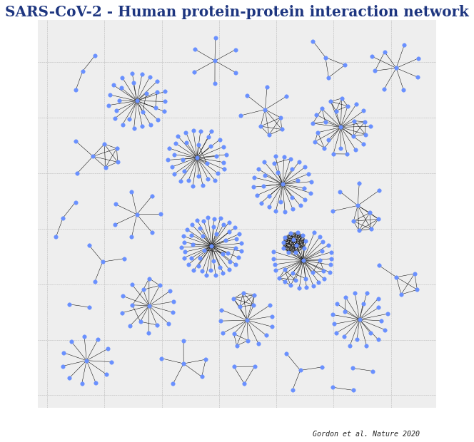
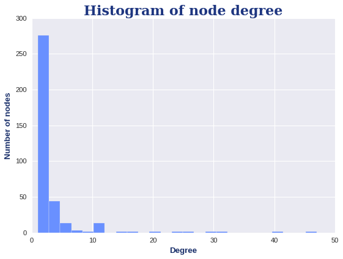
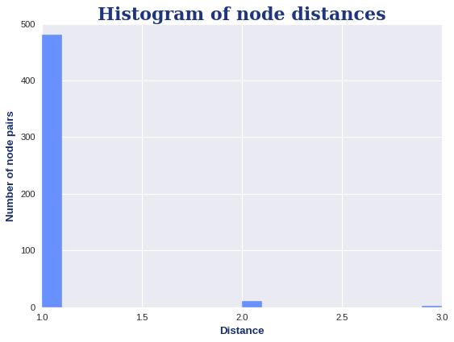
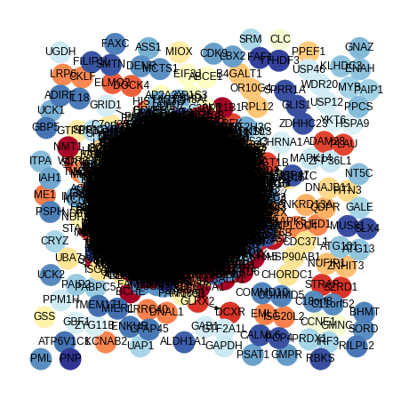
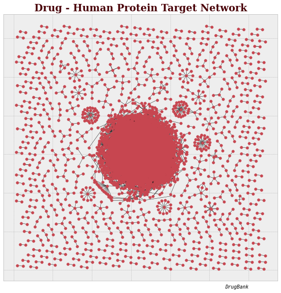

# Network Biology Challenge (CdeCMx):  
## Quantify properties of protein interaction networks   

This repository harbors all the scripts (python, R), networks and other files used during the accomplishment of the CdeCMx 2020 Network Biology Challenge.

## GenoTeam (C-19) - Clubbers  
Elizabeth Márquez  
Kevin Meza Landeros  
Diego Camacho Hernández  
Victor Nieto Caballero

**Data availability:**    
SARS-CoV-2 - Human = http://ndexbio.org/#/network/fe42a2aa-db39-11ea-8772-0ac135e8bacf  
Human PPI = http://www.ndexbio.org/#/networkset/0ec47211-5f92-11e9-9f06-0ac135e8bacf?accesskey=2208334a54dd8f40e904c8f2b7e9d0a50e3b56c26243b271638d55fe6c56ac97   
Drug - Human = https://www.drugbank.ca/pharmaco/genomics    
Workflow based on: https://github.com/jgtz/CdeCMx2020-NetworkBiology  

## General workflow  
***Important Note: Some steps are ommited here, here we show some of the important points. To get the complete workflow take a look of the the attached Jupyter Notebooks.***  

## Step 1  
Use NetworkX to calculate network theory measures (degree, distance, betweeness centrality, and others you might find interesting) on each of the three PPI networks (COVID-Human, Human, Drug-Human). What is the distribution of these network measures? What are the nodes or node pairs with the highest value for these measures in each network?

### SARS-CoV-2 - Human PPI Network  
```python
import pandas as pd
import numpy as np
import random
import networkx as nx
from IPython.display import Image
import matplotlib.pyplot as plt
import collections
```  
```python
#Load the graph
sarscov2_human = nx.read_graphml("./Networks_Challenge/SARS-CoV-2 Host-Pathogen Interaction Map (Fig. 3)).graphml")

# Define position of each node
pos = nx.nx_agraph.graphviz_layout(sarscov2_human,prog='neato')
# # Plot the graph
plt.figure(figsize=(10, 10))
nx.draw_networkx_nodes(sarscov2_human, pos=pos, node_size=30, node_color='#6990FF')
nx.draw_networkx_edges(sarscov2_human, pos=pos,width=0.5,arrows=False)
#Uncomment to label by node number
#nx.draw_networkx_labels(sarscov2_human,pos=pos, font_size=8, alpha=1)
plt.title("SARS-CoV-2 - Human protein-protein interaction network", fontname='serif', fontsize=20, fontweight='bold', color='#1E3680')
plt.text(1300, -150, 'Gordon et al. Nature 2020', horizontalalignment='right', verticalalignment='bottom', fontname='monospace', fontstyle='italic')

plt.style.use('bmh') #ggplot, seaborn, bmh
plt.show()
```



**Degree**  
```python
# The nx.degree function outputs the degree of each node in the network
nx.degree(sarscov2_human)
```

```python
# Through some manipulation, you can rank the nodes by degree in a list of tuples
degree_count = sorted(sarscov2_human.degree, key=lambda x: x[1], reverse=True)
# Prepare two tuples that you can plot against each other
node, degree = zip(*degree_count)
```

```python
plt.hist(degree,bins=25, color='#6990FF')
plt.title('Histogram of node degree', fontname='serif', fontsize=20, fontweight='bold', color='#1E3680')
plt.ylabel('Number of nodes', fontname='sans-serif', fontsize=12, fontweight='heavy', color='#182E69')
plt.xlabel('Degree', fontname='sans-serif', fontsize=12, fontweight='heavy', color='#182E69')
plt.show()
```



**Distances**  

```python
paths=nx.shortest_path(sarscov2_human)
distances=dict(nx.shortest_path_length(sarscov2_human))
```
```python
all_dsit=[]
for n1 in distances.keys():
  l=list(distances[n1].values())
  for val in l:
    all_dsit.append(val)
    
all_dsit=[i for i in all_dsit if i != 0]
```

```python
#Plot the distribution of distances from all nodes

plt.hist(all_dsit,bins=20, color='#6990FF')
plt.title('Histogram of node distances', fontname='serif', fontsize=20, fontweight='bold', color='#1E3680')
plt.ylabel('Number of node pairs', fontname='sans-serif', fontsize=12, fontweight='heavy', color='#182E69')
plt.xlabel('Distance', fontname='sans-serif', fontsize=12, fontweight='heavy', color='#182E69')
plt.show()
```


### Human PPI Network
```python
#Load the graph
human_ppi = nx.read_graphml("./Networks_Challenge/HI_union.graphml")

# Define position of each node
pos = nx.nx_agraph.graphviz_layout(human_ppi,prog='neato')
# # Plot the graph
plt.figure(figsize=(10, 10))
nx.draw_networkx_nodes(human_ppi, pos=pos,node_size=30, node_color='#6BB533')
nx.draw_networkx_edges(human_ppi, pos=pos,width=0.5,arrows=False)
#Uncomment to label by node number
#nx.draw_networkx_labels(sarscov2_human,pos=pos, font_size=8, alpha=1)
plt.title("Human protein-protein interaction network of Lung proteins", fontname='serif', fontsize=20, fontweight='bold', color='#3D6E18')
plt.text(900, -200, 'Luck et al. Nature 2020', horizontalalignment='right', verticalalignment='bottom', fontname='monospace', fontstyle='italic')

plt.style.use('bmh') #ggplot, seaborn, bmh
plt.show()
```


**Communities**  
Using modularity maximization
```python
from networkx.algorithms import community as nxcommunity

communities_modularity = list(nxcommunity.greedy_modularity_communities(nx.Graph(human_ppi)))
communities_modularity_dictionary_temp={node:i for i,community in enumerate(communities_modularity) for node in community}
communities_modularity_dictionary={node:communities_modularity_dictionary_temp[node] for node in list(human_ppi.nodes())}


communities_dictionary=communities_modularity_dictionary
plt.figure(figsize=(8, 8))
plt.axis('off')

nx.draw_networkx(human_ppi, pos, node_size=600,with_labels=True, cmap=plt.cm.RdYlBu, node_color=list(communities_dictionary.values()))
plt.show(human_ppi)
```


Using label propagation  

```python
communities_labelprop = list(nxcommunity.label_propagation.asyn_lpa_communities(human_ppi,seed=10))
communities_labelprop_dictionary_temp={node:i for i,community in enumerate(communities_labelprop) for node in community}
communities_labelprop_dictionary={node:communities_labelprop_dictionary_temp[node] for node in list(human_ppi.nodes())}

plt.figure(figsize=(8, 8))
plt.axis('off')

communities_dictionary=communities_labelprop_dictionary
nx.draw_networkx(human_ppi, pos, node_size=600,with_labels=True, cmap=plt.cm.RdYlBu, node_color=list(communities_dictionary.values()))
plt.show(human_ppi)
```
  

### Drug - Human Protein Target Network

```python
#Load the graph
drug_humanProt = nx.read_graphml("./Networks_Challenge/DrugBank - Combined Network.graphml")

# Define position of each node
pos = nx.nx_agraph.graphviz_layout(drug_humanProt,prog='neato')
# # Plot the graph
plt.figure(figsize=(10, 10))
nx.draw_networkx_nodes(drug_humanProt, pos=pos, node_size=30, node_color='#C74650')
nx.draw_networkx_edges(drug_humanProt, pos=pos,width=0.5,arrows=False)
#Uncomment to label by node number
#nx.draw_networkx_labels(drug_humanProt,pos=pos, font_size=8, alpha=1)
plt.title("Drug - Human Protein Target Network", fontname='serif', fontsize=20, fontweight='bold', color='#4A040A')
plt.text(3000, -250, 'DrugBank', horizontalalignment='right', verticalalignment='bottom', fontname='monospace', fontstyle='italic')

#print(plt.style.available)
plt.style.use('bmh') #ggplot, seaborn, bmh
plt.show()
```



