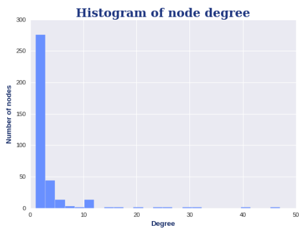

# Network Biology Challenge (CdeCMx):  
## Quantify properties of protein interaction networks   

This repository harbors all the scripts (python, R), networks and other files used during the accomplishment of the CdeCMx 2020 Network Biology Challenge.

## GenoTeam (C-16) - Clubbers  
Elizabeth Márquez  
Kevin Meza Landeros  
Diego Camacho Hernández  
Victor Nieto Caballero

**Data availability:**    
SARS-CoV-2 - Human = http://ndexbio.org/#/network/fe42a2aa-db39-11ea-8772-0ac135e8bacf  
Human PPI = http://www.ndexbio.org/#/networkset/0ec47211-5f92-11e9-9f06-0ac135e8bacf?accesskey=2208334a54dd8f40e904c8f2b7e9d0a50e3b56c26243b271638d55fe6c56ac97   
Drug - Human = https://www.drugbank.ca/pharmaco/genomics    
Workflow based on: https://github.com/jgtz/CdeCMx2020-NetworkBiology  

## General workflow  
***Important Note: Some steps are ommited here, here we show some of the important points. To get the complete workflow take a look of the the attached Jupyter Notebooks.***  

## Step 1  
Use NetworkX to calculate network theory measures (degree, distance, betweeness centrality, and others you might find interesting) on each of the three PPI networks (COVID-Human, Human, Drug-Human). What is the distribution of these network measures? What are the nodes or node pairs with the highest value for these measures in each network?  

For further reading check this file: Challenge_Redes.ipynb

### SARS-CoV-2 - Human PPI Network  
```python
import pandas as pd
import numpy as np
import random
import networkx as nx
from IPython.display import Image
import matplotlib.pyplot as plt
import collections
```  
```python
#Load the graph
sarscov2_human = nx.read_graphml("./Networks_Challenge/SARS-CoV-2 Host-Pathogen Interaction Map (Fig. 3)).graphml")

# Define position of each node
pos = nx.nx_agraph.graphviz_layout(sarscov2_human,prog='neato')
# # Plot the graph
plt.figure(figsize=(10, 10))
nx.draw_networkx_nodes(sarscov2_human, pos=pos, node_size=30, node_color='#6990FF')
nx.draw_networkx_edges(sarscov2_human, pos=pos,width=0.5,arrows=False)
#Uncomment to label by node number
#nx.draw_networkx_labels(sarscov2_human,pos=pos, font_size=8, alpha=1)
plt.title("SARS-CoV-2 - Human protein-protein interaction network", fontname='serif', fontsize=20, fontweight='bold', color='#1E3680')
plt.text(1300, -150, 'Gordon et al. Nature 2020', horizontalalignment='right', verticalalignment='bottom', fontname='monospace', fontstyle='italic')

plt.style.use('bmh') #ggplot, seaborn, bmh
plt.show()
```

  
Black nodes represent viral proteins, while red nodes represent human proteins.

**Degree**  
```python
# The nx.degree function outputs the degree of each node in the network
nx.degree(sarscov2_human)
```

```python
# Through some manipulation, you can rank the nodes by degree in a list of tuples
degree_count = sorted(sarscov2_human.degree, key=lambda x: x[1], reverse=True)
# Prepare two tuples that you can plot against each other
node, degree = zip(*degree_count)
```

```python
plt.hist(degree,bins=25, color='#6990FF')
plt.title('Histogram of node degree', fontname='serif', fontsize=20, fontweight='bold', color='#1E3680')
plt.ylabel('Number of nodes', fontname='sans-serif', fontsize=12, fontweight='heavy', color='#182E69')
plt.xlabel('Degree', fontname='sans-serif', fontsize=12, fontweight='heavy', color='#182E69')
plt.show()
```



**Distances**  

```python
paths=nx.shortest_path(sarscov2_human)
distances=dict(nx.shortest_path_length(sarscov2_human))
```
```python
all_dsit=[]
for n1 in distances.keys():
  l=list(distances[n1].values())
  for val in l:
    all_dsit.append(val)
    
all_dsit=[i for i in all_dsit if i != 0]
```

```python
#Plot the distribution of distances from all nodes

plt.hist(all_dsit,bins=20, color='#6990FF')
plt.title('Histogram of node distances', fontname='serif', fontsize=20, fontweight='bold', color='#1E3680')
plt.ylabel('Number of node pairs', fontname='sans-serif', fontsize=12, fontweight='heavy', color='#182E69')
plt.xlabel('Distance', fontname='sans-serif', fontsize=12, fontweight='heavy', color='#182E69')
plt.show()
```


### Human PPI Network
```python
#Load the graph
human_ppi = nx.read_graphml("./Networks_Challenge/HI_union.graphml")
human_ppi= nx.Graph(human_ppi)
dic=dict(human_ppi.nodes(data=True))
for d in dic:
  dic[d]["Bait_Boolean"]=0
node_color=[((int(dic[n]["Bait_Boolean"]))) for n in dic ]
# Define position of each node
pos = nx.nx_agraph.graphviz_layout(human_ppi,prog='neato')
# Plot the graph
plt.figure(figsize=(10, 10))
nx.draw_networkx_nodes(human_ppi, pos=pos,node_size=30, node_color=node_color)
nx.draw_networkx_edges(human_ppi, pos=pos,width=0.5,arrows=False)
#Uncomment to label by node number
#nx.draw_networkx_labels(sarscov2_human,pos=pos, font_size=8, alpha=1)
plt.text(900, -200, 'Luck et al. Nature 2020', horizontalalignment='right', verticalalignment='bottom', fontname='monospace', fontstyle='italic')
plt.title("Human protein-protein interaction network", fontname='serif', fontsize=20, fontweight='bold', color='#1E3680')
plt.style.use('bmh') #ggplot, seaborn, bmh
plt.show()
```


**Communities**  
Using modularity maximization
```python
from networkx.algorithms import community as nxcommunity

communities_modularity = list(nxcommunity.greedy_modularity_communities(nx.Graph(human_ppi)))
communities_modularity_dictionary_temp={node:i for i,community in enumerate(communities_modularity) for node in community}
communities_modularity_dictionary={node:communities_modularity_dictionary_temp[node] for node in list(human_ppi.nodes())}


communities_dictionary=communities_modularity_dictionary
plt.figure(figsize=(8, 8))
plt.axis('off')

nx.draw_networkx(human_ppi, pos, node_size=600,with_labels=True, cmap=plt.cm.RdYlBu, node_color=list(communities_dictionary.values()))
plt.show(human_ppi)
```


Using label propagation  

```python
communities_labelprop = list(nxcommunity.label_propagation.asyn_lpa_communities(human_ppi,seed=10))
communities_labelprop_dictionary_temp={node:i for i,community in enumerate(communities_labelprop) for node in community}
communities_labelprop_dictionary={node:communities_labelprop_dictionary_temp[node] for node in list(human_ppi.nodes())}

plt.figure(figsize=(8, 8))
plt.axis('off')

communities_dictionary=communities_labelprop_dictionary
nx.draw_networkx(human_ppi, pos, node_size=600,with_labels=True, cmap=plt.cm.RdYlBu, node_color=list(communities_dictionary.values()))
plt.show(human_ppi)
```
  

### Drug - Human Protein Target Network

```python
#Load the graph
drug_humanProt = nx.read_graphml("./Networks_Challenge/DrugBank - Combined Network.graphml")

# Define position of each node
pos = nx.nx_agraph.graphviz_layout(drug_humanProt,prog='neato')
# # Plot the graph
plt.figure(figsize=(10, 10))
nx.draw_networkx_nodes(drug_humanProt, pos=pos, node_size=30, node_color='#C74650')
nx.draw_networkx_edges(drug_humanProt, pos=pos,width=0.5,arrows=False)
#Uncomment to label by node number
#nx.draw_networkx_labels(drug_humanProt,pos=pos, font_size=8, alpha=1)
plt.title("Drug - Human Protein Target Network", fontname='serif', fontsize=20, fontweight='bold', color='#4A040A')
plt.text(3000, -250, 'DrugBank', horizontalalignment='right', verticalalignment='bottom', fontname='monospace', fontstyle='italic')

#print(plt.style.available)
plt.style.use('bmh') #ggplot, seaborn, bmh
plt.show()
```
  
Purple nodes represent human proteins, while yellow nodes represent drugs.

**Betweenness Centrality**
```python
# You can generate a dictionary containing the node and the BC
betweenness = nx.betweenness_centrality(nx.Graph(drug_humanProt))
# Make values into a list
bc = list(betweenness.values())
#betweenness
```
```python
plt.hist(bc,bins=35, color = '#C74650')
plt.title('Histogram of betweeness centrality', fontname='serif', fontsize=20, fontweight='bold', color='#4A040A')
plt.ylabel('Number of nodes', fontname='sans-serif', fontsize=12, fontweight='heavy', color='#91333B')
plt.xlabel('Betweenness Centrality', fontname='sans-serif', fontsize=12, fontweight='heavy', color='#91333B')
plt.show()
```


**Degree centrality**
```python
degree_centrality = nx.degree_centrality(drug_humanProt)
degree_cent = list(degree_centrality.values())

plt.bar(list(drug_humanProt.nodes()), degree_cent, color = '#C74650')

plt.title('Degree Centrality by Node', fontname='serif', fontsize=20, fontweight='bold', color='#4A040A')
plt.xlabel('Node', fontname='sans-serif', fontsize=12, fontweight='heavy', color='#91333B')
plt.ylabel('Degree Centrality', fontname='sans-serif', fontsize=12, fontweight='heavy', color='#91333B')

```
  

## Step 2  
Combine these three PPI networks. Do the same as in part 1 but for this combined network.  
For further reading check this file: Challenge_Redes.ipynb

Here we show the merged network from the 3 previous ones. Viral proteins are highlighted in color meant, human proteins in purple ans drugs in red.  
  

Then we show the giant components of the merged network, it follows the same color code:  
 

## Bonus 1  
We decided to make subgraphs from thee merged graph, but this time focusing on an specific drug and we analyzed its neighbors to make a functional analysis.  
For further reading check this file: Farmacos.ipynb   
Enrichment interactive Plot: gprofChallenge.html

### Dexamethasone
```python
#Load the graph
merge = nx.read_graphml("./Networks_Challenge/merge2a.graphml")

import itertools

# Primeros vecinos
vecinos_Dexamethasone = [n for n in merge.neighbors("Dexamethasone") if merge.nodes(data=True)[n]["Bait_Boolean"] == 0 ]
# Vecinos segundos
#vecinos_2 = [i for i in list(merge.neighbors(n)) for n in vecinos_Dexamethasone if merge.nodes(data=True)[i]["Bait_Boolean"] == 0]
vecinos_2 = []
for n in vecinos_Dexamethasone:
  lista = list(merge.neighbors(n))
  for i in lista:
    if merge.nodes(data=True)[i]["Bait_Boolean"] == 0:
      vecinos_2.append(i)
# Vecinos terceros
vecinos_3 = []
for n in vecinos_2:
  lista = list(merge.neighbors(n))
  for i in lista:
    if merge.nodes(data=True)[i]["Bait_Boolean"] == 0:
      vecinos_3.append(i)
# Juntamos las 3 generaciones de vecinos (solo proteinas)
vecinos_Dexamethasone.extend(vecinos_2)
vecinos_Dexamethasone.extend(vecinos_3)

```

```python
vecinos_Hydroxychloroquine.append("Hydroxychloroquine")
subgraph_Hydroxychloroquine = merge.subgraph(vecinos_Hydroxychloroquine)

# Node Colors
dict_color={}
for node in subgraph_Dexamethasone.nodes():
  if (subgraph_Dexamethasone.nodes(data="Bait_Boolean")[node]==0):
    dict_color[node]="orange"
  else:
    dict_color[node]="green"
nx.set_node_attributes(subgraph_Dexamethasone, dict_color, 'node_color')
node_colors=dict(subgraph_Dexamethasone.nodes(data="node_color")).values()
```
```python
pos = nx.nx_agraph.graphviz_layout(subgraph_Dexamethasone,prog='neato')
# # Plot the graph
plt.figure(figsize=(10, 10))
nx.draw_networkx_nodes(subgraph_Dexamethasone, pos=pos,node_size=300,alpha=0.5,node_color=node_colors)
nx.draw_networkx_edges(subgraph_Dexamethasone, pos=pos,width=1,arrows=False,alpha=0.5)
#Uncomment to label by node number
nx.draw_networkx_labels(subgraph_Dexamethasone,pos=pos, font_size=8, alpha=1)
plt.title("(Dexamethasone - Human Proteins) Interaction Graph", fontname='serif', fontsize=20, fontweight='bold', color='#463769')
plt.style.use('bmh') #ggplot, seaborn, bmh
plt.show()
```

  
We can see the drug in color green, and the human proteins in color yellow.  

Fucntional and pathway enrichment:  
 


### Hydroxycloroquine

```python
import itertools

# Primeros vecinos
vecinos_Hydroxychloroquine = [n for n in merge.neighbors("Hydroxychloroquine") if merge.nodes(data=True)[n]["Bait_Boolean"] == 0 ]
# Vecinos segundos
#vecinos_2 = [i for i in list(merge.neighbors(n)) for n in vecinos_Dexamethasone if merge.nodes(data=True)[i]["Bait_Boolean"] == 0]
vecinos_2 = []
for n in vecinos_Hydroxychloroquine:
  lista = list(merge.neighbors(n))
  for i in lista:
    if merge.nodes(data=True)[i]["Bait_Boolean"] == 0:
      vecinos_2.append(i)

# Vecinos terceros
vecinos_3 = []
for n in vecinos_2:
  lista = list(merge.neighbors(n))
  for i in lista:
    if merge.nodes(data=True)[i]["Bait_Boolean"] == 0:
      vecinos_3.append(i)

# Juntamos las 3 generaciones de vecinos (solo proteinas)
vecinos_Hydroxychloroquine.extend(vecinos_2)
vecinos_Hydroxychloroquine.extend(vecinos_3)
```

```python
vecinos_Hydroxychloroquine.append("Hydroxychloroquine")
subgraph_Hydroxychloroquine = merge.subgraph(vecinos_Hydroxychloroquine)

# Node Colors
dict_color={}
for node in subgraph_Hydroxychloroquine.nodes():
  if (subgraph_Hydroxychloroquine.nodes(data="Bait_Boolean")[node]==0):
    dict_color[node]="orange"
  else:
    dict_color[node]="green"
nx.set_node_attributes(subgraph_Hydroxychloroquine, dict_color, 'node_color')
node_colors=dict(subgraph_Hydroxychloroquine.nodes(data="node_color")).values()
```

```python
pos = nx.nx_agraph.graphviz_layout(subgraph_Hydroxychloroquine,prog='neato')
# # Plot the graph
plt.figure(figsize=(10, 10))
nx.draw_networkx_nodes(subgraph_Hydroxychloroquine, pos=pos,node_size=300,alpha=0.5,node_color=node_colors)
nx.draw_networkx_edges(subgraph_Hydroxychloroquine, pos=pos,width=1,arrows=False,alpha=0.5)
#Uncomment to label by node number
nx.draw_networkx_labels(subgraph_Hydroxychloroquine,pos=pos, font_size=8, alpha=1)
plt.title("(Hydroxychloroquine - Human Proteins) Interaction Graph", fontname='serif', fontsize=20, fontweight='bold', color='#463769')
plt.style.use('bmh') #ggplot, seaborn, bmh
plt.show()
```

  
We can see the drug in color green, and the human proteins in color yellow.  

Fucntional and pathway enrichment:  
 

## Bonus 2  
Unfortunately we did not managed to complete this part, as we have just some partial results. But the idea behind this, was to use tissue specific networks (lung & liver) and merge them again with the SARS-CoV2/Human and Drug/Human Networks. Then, we would see how tissue specific proteins are connected with SARS-CoV2 proteins and  if this interactions are related to the observed tissue specific symptoms by making a functional analysis. After this we wanted to analyze if some known drugs affected certain fucntions of the organs and try to elucidate the way drugs act in an specific organ/tissue.    

For further reading check this file: tissue.ipynb
